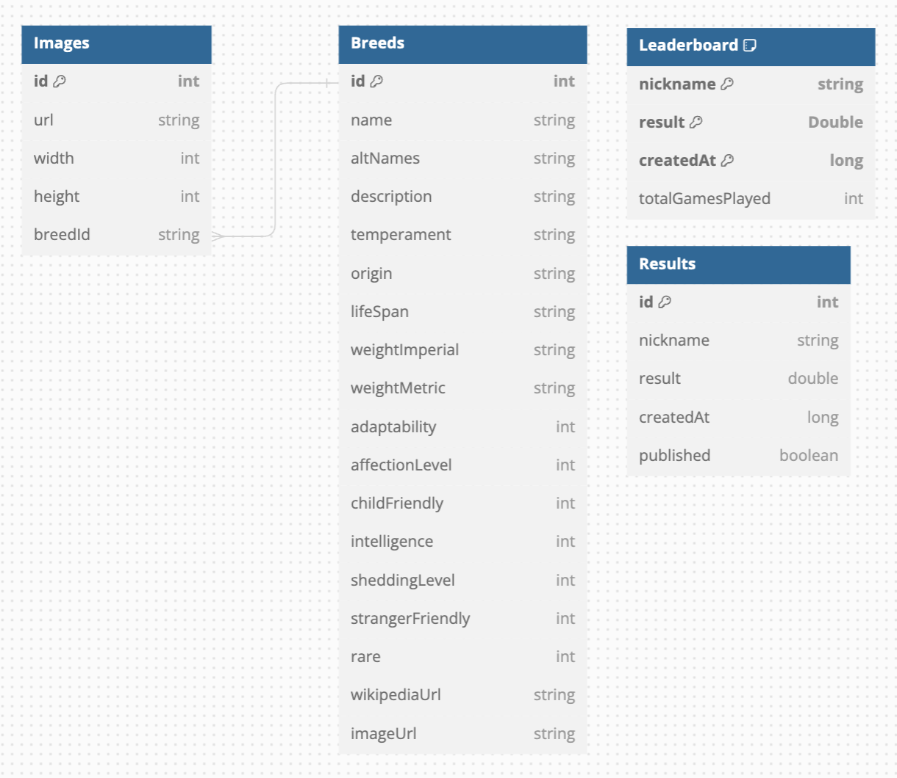
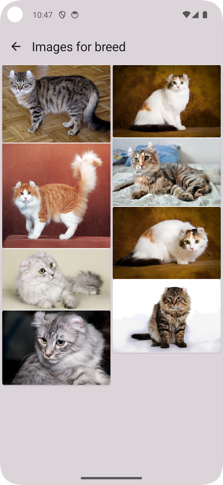

# Catapult Mobile App
This is an Android mobile application developed as part of the university subject "Mobile Apps Development". It has 2 main parts:
**discovery** of new cat breeds and a **quiz** about the cat breeds.

## Functionalities
Catapult consists of 4 main [segments](app/src/main/java/com/example/catapult/segments/):

1. **User Segment:**
    - Creating a local account on the first run of the app
    - Profile screen: profile details and history of played games
    - Edit profile details screen

2. **Cat Breeds Segment:**
    - Breeds list screen: list of all cat breeds, complete with previews and a search option
    - Breed details screen: detailed information about the selected breed
    - Gallery of breed photos
    - Photo viewer

3. **Leaderboard Segment:**
    - Leaderboard screen: list of published games on the global leaderboard, sorted descending by score

4. **Quiz Segment:**
    - Start quiz screen: button to start the quiz
    - Quiz screen: quiz consists of 20 questions (image of a cat and a question about it with 4 offered answers). The questions are generated randomly when the user starts the quiz. The questions include:
        1. Which breed is the cat?
        2. Which temperament belongs to this cat?
        3. Which temperament does **not** belong to this cat?

## Technical Requirements
1. **Model-View-Intent (MVI)** pattern for architecture
2. **Kotlin Coroutines** for asynchronous programming
3. **Jetpack Compose** for user interface
4. **Jetpack Room** for database
5. **Jetpack DataStore** for user profile
6. **Hilt Dependency Injection** for dependency management

## Visual Requirements
1. **Light and Dark Theme** utilizing [Material Design 3](https://m3.material.io/components) from Jetpack Compose
2. **App Drawer Navigation** for navigation the app
3. **Animations** for the transition between quiz questions

## Database
Local SQLite database using Jetpack Room. All the information is kept in the database, except the local user profile information which is kept in the [DataStore](app/src/main/java/com/example/catapult/data/datastore). Database schema can be seen [here](docs/database.png).

## APIs
TODO

## Screenshots

     
    
    
    

    
     
    
    

    
     
    
    

